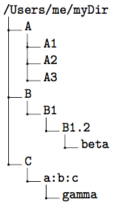

# dirtreex
A directory-tree generation script for LaTeX

## What is this?
A python script that automagically  generates the code to represent a directory tree in LaTeX using the [dirtree](http://get-software.net/macros/generic/dirtree/dirtree.pdf) package.

## Give me an example!
    > python dirtreex.py /Users/me/myDir
    \dirtree{%
     .1 /Users/me/myDir .
      .2 A .
       .3 A1 .
       .3 A2 .
       .3 A3 .
      .2 B .
       .3 B1 .
        .4 B1.2 .
         .5 beta .
      .2 C .
       .3 a:b:c .
        .4 gamma .
    }

The previous code renders in LaTeX as follows:

## Are there any optional arguments?
Yep

    > python dirtreex.py -h
    usage: dirtreex.py [-h] [-d MAXDEPTH] [-H] [-S] path

    Print the directory-tree code for the LaTeX dirtree package.

    positional arguments:
      path                  Root directory of the tree

    optional arguments:
      -h, --help            show this help message and exit
      -d MAXDEPTH, --maxDepth MAXDEPTH
                            Max depth for the tree expansion
      -H, --includeHidden   Include hidden files
      -S, --includeSystem   Include system files

## Have you tested it on Windows?
Nope. I wrote this for OS X and it should be compatible with any Unix system. 
The `-H` flag shouldn't work on Windows due to a different representation of hidden files.

## How do I use it?
### Install the requirements:

Obviously you will need [Python](https://www.python.org/downloads/) (tested on 2.7) and then install the `walkdir` library:

    pip install walkdir

### Download the script:
Direct link [here](https://raw.githubusercontent.com/dimatteomaurizio/dirtreex/master/dirtreex.py) or checkout the repository.

### Run it:

the quick way:

    > python /path/to/script/dirtreex.py /treeRoot

the other way:
    
    > sudo chmod +x /path/to/script/dirtreex.py
    > mv /path/to/script/dirtree.py /usr/local/bin
    > dirtreex.py /treeRoot
